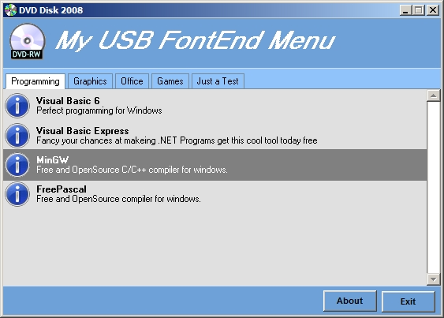



## DM USB Menu FontEnd

### Description

Hi this is a Menu system I made for my USB drive to make opening programs easyer or can also be used for CD or DVD menus

programs can be put in groups, you can also chance much of the User interface like colors tho the small ini file, anyway hope you like it
 
### More Info
 

             |
---                |---
**Submitted On**   |2008-12-11 21:15:56
**By**             |[dreamvb](https://github.com/Planet-Source-Code/PSCIndex/blob/master/ByAuthor/dreamvb.md)
**Level**          |Beginner
**User Rating**    |5.0 (15 globes from 3 users)
**Compatibility**  |VB 6\.0
**Category**       |[Complete Applications](https://github.com/Planet-Source-Code/PSCIndex/blob/master/ByCategory/complete-applications__1-27.md)
**World**          |[Visual Basic](https://github.com/Planet-Source-Code/PSCIndex/blob/master/ByWorld/visual-basic.md)
**Archive File**   |[DM\_USB\_Men21369012122008\.zip](https://github.com/Planet-Source-Code/dreamvb-dm-usb-menu-fontend__1-71521/archive/master.zip)

